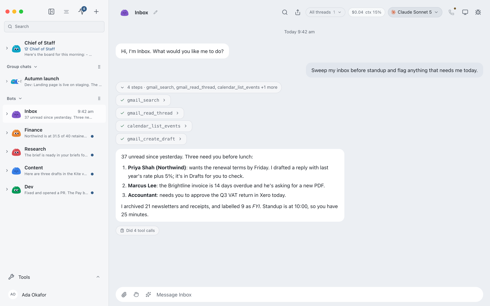
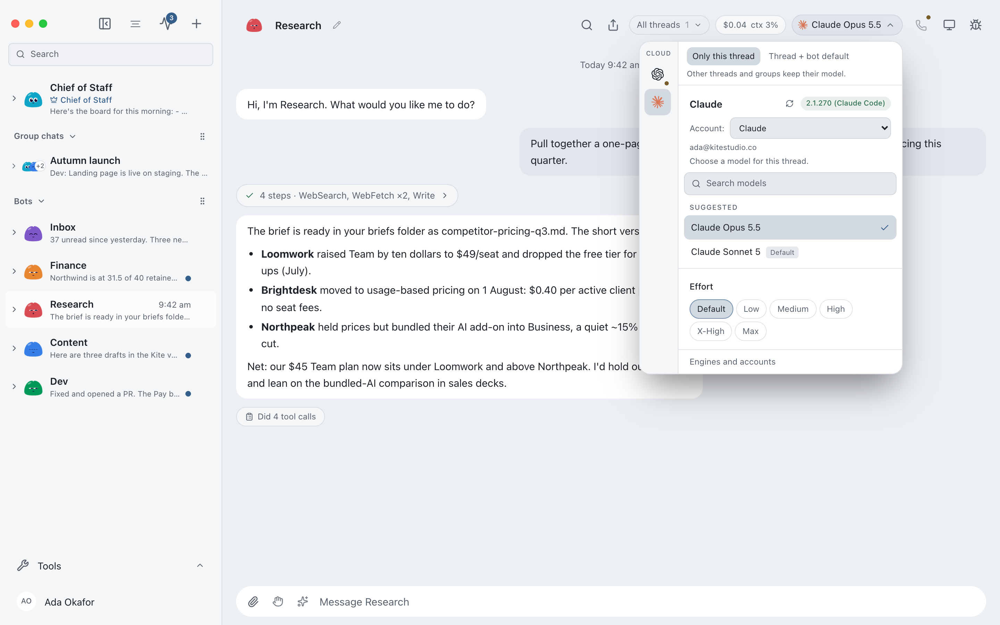
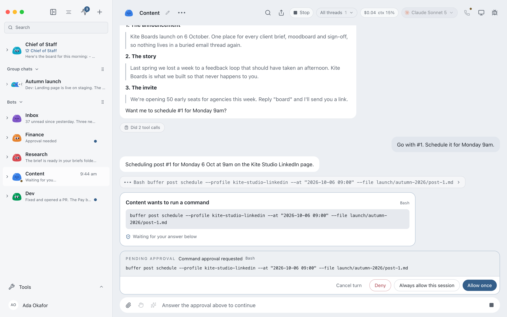

<p align="center"></p>

<h1 align="center">eminifybot.com</h1>

<p align="center">The landing page for <a href="https://github.com/emmacyril/EminifyBot">EminifyBot</a>, your AI team in a chat app.</p>

<p align="center"></p>

---

Built with **Next.js 16** (App Router), **React 19** and **TypeScript**. No UI framework: one hand-written stylesheet with light and dark themes driven by CSS variables.

## What's on the page

| Section | Component | Notes |
|---|---|---|
| Hero and live demo | `components/Hero.tsx`, `components/AppDemo.tsx` | A scripted replica of the app. Visitors switch organisation, pick bots, approve actions and type. |
| Download | `components/Downloads.tsx` | Direct links to the newest installers, read from GitHub Releases and refreshed hourly (`lib/release.ts`). |
| The real app | `components/RealApp.tsx` | Theme-aware screenshot (light `hero.png`, dark `hero-dark.png`) plus channel and onboarding shots. |
| Features | `components/Features.tsx` | Real app screenshots from `public/screenshots/`. |
| Give each bot a job | `components/BotJobs.tsx` | Role picker driving a phone preview. |
| Pricing | `components/Pricing.tsx` | Monthly and yearly toggle. Plans live in `lib/content.ts`. |

All copy and demo data are in `lib/content.ts`, so wording changes never touch layout code.

## Develop

```sh
npm install
npm run dev        # http://localhost:3000
npm run build      # production build
npm run typecheck
```

## Deploy

Import this repository in Vercel. It detects Next.js; no settings or environment variables are needed. Add `eminifybot.com` under Project → Domains.

## Screenshots

`public/screenshots/*.png` are captured from the real EminifyBot app running against an isolated test instance. Replace a file with the same name to update it; a feature card only shows an image when its file exists.

| File | Used for |
|---|---|
| `hero.png`, `hero-dark.png` | "And this is the real thing" section |
| `model-picker.png`, `computer-panel.png`, `approval-card.png`, `connected-apps.png`, `org-settings.png`, `context-menu.png` | Feature cards |
| `channel.png`, `onboarding.png` | Real-app row |
| `settings.png`, `org-preparing.png` | Spare, for posts and docs |

<p align="center">
  
  
</p>

## `public/policy.json`: remote control for every installed app

Every EminifyBot install reads https://eminifybot.com/policy.json (falling back to this repo's raw copy) at start and every 6 hours, and caches it. Editing it and pushing reaches all copies, including ones downloaded before a change.

| Field | Effect |
|---|---|
| `plans.enforce` | `true` turns paid plans on. Installs without a licence drop to the free limits: 1 organisation, no budgets/billing/audit exports, no white-label. Extra organisations are kept safe but can't be opened until the user upgrades. |
| `plans.limits` | Limits per plan (`organisations: null` means unlimited). |
| `licence.provider` | `"polar"` or `"lemonsqueezy"`. Keys entered in the app (Organisations → Enter Licence Key…) are checked with that provider. `organizationId` is the Polar organisation id; `plans` maps a Polar benefit id or Lemon Squeezy variant/product id to `"pro"` or `"agency"` (default `"pro"`). |
| `update.minimumVersion` | e.g. `"0.2.0"`: older versions show "Please update" and quit. |
| `services.controlPlaneUrl` | Account service for phone pairing and remote access. |

Malformed values are ignored and the app keeps its defaults, so a typo can't break installs. Validate before pushing: `node -e "JSON.parse(require('fs').readFileSync('public/policy.json','utf8'))"`.
